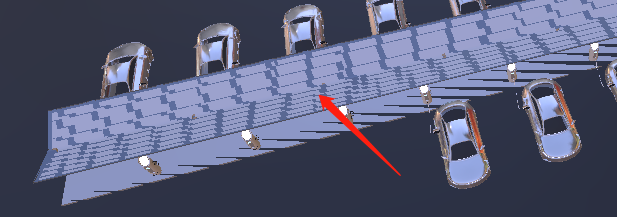
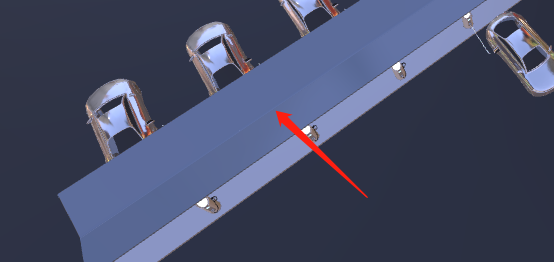

### ThreeJS开发需要注意的问题

### 优先使用clone

- 如果需要遍历大量的重复模型，应该使用clone，而不是多次loader同一个模型

### 实例卡顿

- 基于Vue开发的情况下，与数据不相关的一些实例，不要放到data中，会造成不必要的性能开销，导致出现卡顿的现象。另外，但如果放在Vue实例以外的位置，要记得手动清除实例，没有断掉引用，会一直占着内存。

```javascript
// 以下实例与数据无关，不放在Vue的data中，避免不必要的性能开销（会卡顿）
let __scene__ = null  // 场景
let __camera__ = null   // 相机
let __renderer__ = null   // 渲染器
let __controls__ = null   // 控制器
/* 模型实例 */
let __model_plane__ = null
let __model_shelf__ = null
let __model_charger_good__ = null
let __model_charger_error__ = null
let __model_car_nocharging__ = null
let __model_car_charging__ = null

export default {
    data() {
        // requestAnimationFrame返回的ID
        raf_Id: 0,
        /* 页面数据 */
        infoList: [],
        ...
    },
    methods: {
        animate() {
            // 将返回的ID保存好，消除实例时要做取消
            this.raf_Id = window.requestAnimationFrame(this.animate)
            ...

        },
        ....
    },
    beforeDestroy() {
        __scene__ = null
        __camera__ = null
        __renderer__ = null
        __controls__ = null

        __model_plane__ = null
        __model_shelf__ = null
        __model_charger_good__ = null
        __model_charger_error__ = null
        __model_car_nocharging__ = null
        __model_car_charging__ = null
      
        window.cancelAnimationFrame(this.raf_Id)
    }
}
```

> 参考：https://www.zhihu.com/question/282006485

### 锯齿的问题



```javascript
__renderer__ = new THREE.WebGLRenderer({
    antialias: true,    // 执行抗锯齿
    logarithmicDepthBuffer: true	// 使用对数深度缓存
})
```

###### 效果：



> antialias - 是否执行抗锯齿。默认为**false**.
>
> logarithmicDepthBuffer - 是否使用对数深度缓存。如果要在单个场景中处理巨大的比例差异，就有必要使用。

产生的原因：[Z-Fighting](https://zhuanlan.zhihu.com/p/78769570)

#### 阴影效果

必备条件：

1. 渲染器开启阴影渲染：`renderer.shadowMapEnabled = true;`
2. 灯光需要开启“引起阴影”：`light.castShadow = true;`
3. 物体需要开启“引起阴影”和“接收阴影”：`mesh.castShadow = mesh.receiveShadow = true;`

除此以外，光线也有不同效果：

###### 平行光源

    对于平行光，还需要设置`light.shadow.camera` 下的这6个属性：`near`、`far`、`left`、`right`、`top`、`bottom`。使阴影在这6个面描述的范围内才能显示，否则可能只显示一部分或者不显示阴影，可以借助Camerahelper进行调整

```javascript
const directionalLight = new THREE.DirectionalLight(0xffffff, 1 );
directionalLight.position.set(-200, 200, 0);
// 阴影相关
directionalLight.castShadow = true
directionalLight.shadow.camera.left = -300
directionalLight.shadow.camera.right = 300
directionalLight.shadow.camera.top = -200
directionalLight.shadow.camera.bottom = 200
/* helper */
__scene__.add( new THREE.DirectionalLightHelper( directionalLight, 5 ) )
__scene__.add( new THREE.CameraHelper( directionalLight.shadow.camera ) );
```

    参考：https://cloud.tencent.com/developer/article/1355840