# je-practice-webpack

webpack5学习笔记👇👇👇

## 一、不使用webpack的情况

如果不使用webpack打包，在用模块化引入时，例如ES6

```javascript
import { sum } from './js/utils.js'
```

报错信息：

> Uncaught SyntaxError: Cannot use import statement outside a module

可以在 `<script>`标签加上 `type="module"`来解决

```HTML
<script src="./index.js" type="module"></script>
```

但是如果其他文件使用了CommonJS模块，这个时候还是会报错，所以我们需要使用打包工具去帮我们解决这个问题。

## 二、webpack引入

安装webpack：

```
npm init -y
npm i -D webpack webpack-cli
```

打包：

```
npx webpack
```

默认会将 `src`下的 `index.js`文件作为入口文件，将 `dist`作为打包后的目录。

修改入口文件：

```
npx webpack --entry ./src/main.js
```

修改打包后的输出目录

```
npx webpack --output-path ./build
```

打包出来的文件，可以直接引用，不会报错（把 `type="module"`删掉做测试）

```HTML
<script src="../build/main.js"></script>
```

## 三、webpack配置文件

配置项毕竟是有很多的，每次都在命令行写太费劲了，所以可以提前写好 `webpack.config.js`文件。

package.json

```json
{
  "script": {
    "build": "npx webpack"
  }
}
```

webpack.config.js

```javascript
const path = require('path')
module.exports = {
  entry: './src/main.js',
  output: {
    filename: 'build.js',
    path: path.resolve(__dirname, 'dist')
  }
}
```

【注意】entry可以使用相对路径，但是output.path是要求需要使用绝对路径的，所以要这样写来得到一个绝对路径 `path.resolve(__dirname,'dist')`

> - configuration.output.path: The provided value "./dist" is not an absolute path!
>   -> The output directory as **absolute path** (required).

index.html

```HTML
<script src="../dist/build.js"></script>
```

打包：

```
npm run build
```

【补充】webpack配置文件自定义

例如 `webpack.config.js`被改成 `abc.js`，可以使用 `--config`来修改处理的配置文件名

```
npx webpack --config abc.js
```

## 四、webpack的依赖关系

现在看起来，打包出来的目录里，文件只有一个js文件，没有 `index.html`文件。

这是因为在入口文件 `main.js`里没有写任何跟 `index.html`文件的依赖关系，webpack是不会去处理这些文件的。假如在main.js相同目录下新建任何js文件，在与 `main.js`没有任何依赖关系的前提下进行webpack打包，webpack也是会直接忽略这些文件的。

## 五、其他文件的处理

webpack 自身只理解 JavaScript，如果需要处理例如css、图片、html等文件，则需要在配置文件提前配置好一些loader，才能一起进行打包处理。

如果直接引用，然后执行打包，是会报错的。

> RROR in ./src/css/createElement.css 1:0
> Module parse failed: Unexpected token (1:0)
> You may need an appropriate loader to handle this file type, currently no loaders are configured to process this file. See https://webpack.js.org/concepts#loaders

### css-loader

安装：

```
npm i -D css-loader
```

配置loader：

- 方式一：行内loader

```
import 'css-loader!../css/index.css';
```

- 方式二：配置文件loader

```
module.exports = {
	...
	module: {
		rules: [
			// 1.写法一，完整的写法。
			{
				test: /\.css$/,	// 正则表达式，匹配文件
				use: [
					{
						loader: 'css-loader',	// loader
						options: {}		// 可选项，例如用户传入参数，根据参数响应不同行为等，具体看文档
					}
				]
			},
			// 2.写法二，简写，单个loader的情况可直接这么写。
			{
				test: /\.css$/,
				loader: 'css-loader'
			},
			// 3.写法三，简写，多个loader的情况可这么写，use数组里面可以同时存在【字符串】和【对象】元素。
			{
				test: /\.css$/,
				use: [
					'css-loader',
					{
						loader: 'style-loader',
						options: {}
					}
        ]
			}
		]
	}
}
```

【补充】Webpack4可在命令行进行设置loader，但是5.0已废弃⚠️

【注意】css-loader只能让js能够识别css文件的语法内容，但是要真正使样式生效，还不够，还需要style-loader。

### style-loader

安装

```
npm i -D style-loader
```

配置：

```
module.exports = {
	module: {
		rules: [
			{
				test: /\.css$/,
				use: ['style-loader', 'css-loader']
			}
		]
	}
}
```

加上 `style-loader`之后，页面样式就可以生效了。


【注意】`use`数组是有执行顺序的，默认是从后往前执行，每次执行完的结果，传递给下一个loader执行。所以如果顺序写反了，是会报错的！

```
use: ['css-loader', 'style-loader']	// 顺序写反
```

> ERROR in ./src/css/createElement.css
> Module build failed (from ./node_modules/css-loader/dist/cjs.js):

### less-loader

安装：

```
npm i -D less less-loader
```

【注意】less-loader是需要依赖less编译的，所以不要忘记安装less

配置：

```
module.exports = {
	module: {
		rules: [
			{
				test: /\.less$/,
				use: ['style-loader', 'css-loader', 'less-loader']		// 注意执行顺序
			}
		]
	}
}
```

## 六、兼容性处理相关工具

### browsersList

​	[browsersList](https://github.com/browserslist/browserslist#readme)可以根据我们配置的一些条件参数，从[Can I use](https://caniuse.com/usage-table)站点，去筛选出符合条件的各浏览器版本。

​	比如配置条件是`市场占有率`大于1%、版本是最新的前两个版本之类的，去返回对应的浏览器列表。有了筛选出的浏览器版本列表，我们就可以再使用其他工具进行对应浏览器的一些兼容性进行处理。


【使用方式】

1. 命令行

```js
// 在命令行输入，表示市场占有率大于1%，以及最新的两个版本(似乎只有mac支持)
npx browserslist '>1%,last 2 version'
// 使用默认配置获取
npx browserslist
```

```
// 输出
jeffrey@jeffrey-macbook je-webpack-practice % npx browserslist '>1%, last 2 version'
and_chr 96
and_ff 94
and_qq 10.4
and_uc 12.12
android 96
...
```

2. package.json

```
{
	"browserslist": [
		">1%",
		"last 2 version",
		"not dead"
	]
}
```

3. .browserslistrc

   在根目录下创建`.browserslistrc`文件

```
> 1%
last 2 version AND not dead
```


### postcss

​	[Postcss](https://www.postcss.com.cn/) 是一个用 JavaScript 工具和插件转换 CSS 代码的工具

【安装】

```
npm i -D postcss postcss-cli autoprefixer
```

​	注：

- postcss可以当作是一个编译器，可以利用其他插件工具对css文件进行处理；
- postcss-cli是为了在使用命令行工具才安装的，不需要可以不安装；
- Autoprefixer 是一会儿要用的插件，可以自动补充前缀。


【使用方式】

命令行：

```
npx postcss --use autoprefixer -o result.css ./src/css/testpostcss.css
```

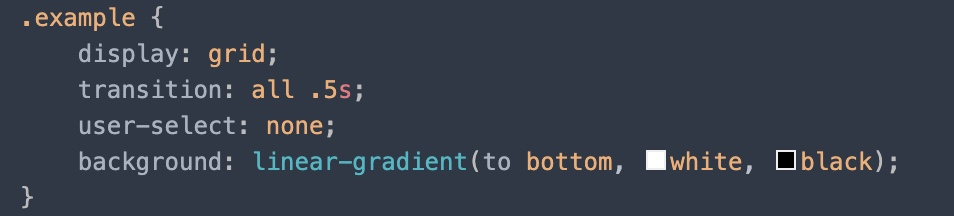

<p align="center">图6-1 执行前 testpostcss.css</p>

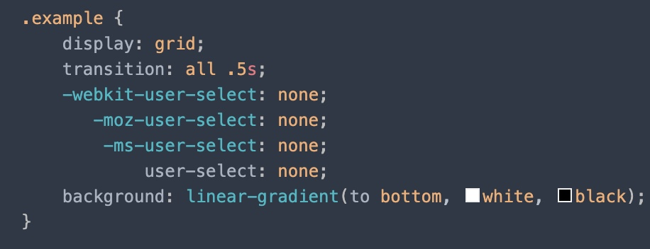

<p align="center">图6-2 执行后  result.css</p>

使用配置文件：

​	安装`postcss-loader`

```
npm i -D postcss-loader
```

webpack.config.js

```
const path = require('path')

module.exports = {
    entry: './src/main.js',
    output: {
        filename: 'build.js',
        path: path.resolve(__dirname, 'dist')
    },
    module: {
        rules: [
            {
                test: /\.css$/,
                use: [
                    'style-loader',
                    'css-loader',
                    {
                        loader: 'postcss-loader',
                        options: {	// 在此处传如可选项，可以配置需要使用的插件
                            postcssOptions: {
                                plugins: [
                                    require('autoprefixer')	// 使用autoprefixer
                                ]
                            }
                        }
                    }
                ]
            },
            {
                test: /\.less$/,
                use: ['style-loader', 'css-loader', 'less-loader']
            }
        ]
    }
}
```

​	`postcss-loader` 放在 `css-loader`之前处理，options中的配置，可以指定使用哪些插件进行配置，具体写法由官方提供，按约定进行配置即可。

​	如上代码，使用了`autoprefixer`插件进行处理后，生成的css文件中，部分属性加了前缀进行的兼容性的处理。

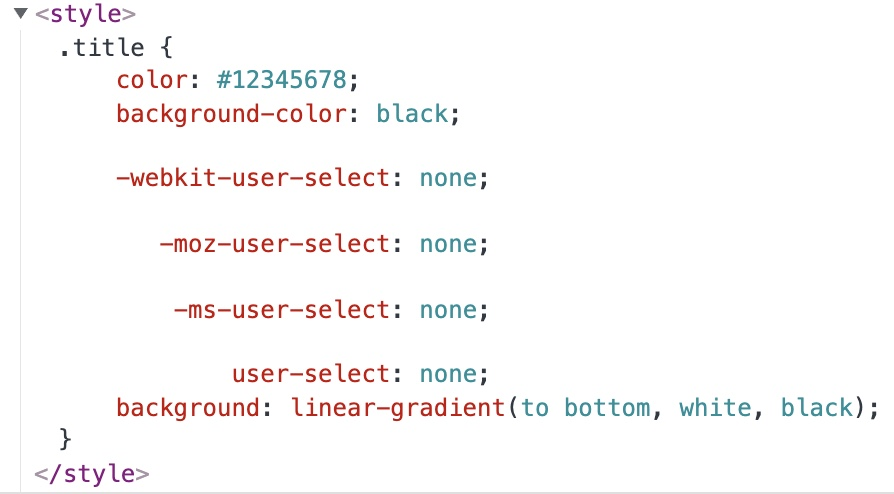

​	可以看到处理后的结果，`user-select`属性自动补充了前缀。

​	另外，可以看到color的值是`#12345678`这是css的新的语法，目前chrome已经兼容，样式上可以看到最后的`78`其实是透明度的设置，但是并不是所有浏览器都兼容了这个语法，所以可以使用另外一个插件`postcss-preset-env`进行最大程度的属性值兼容转化。

安装：

```
npm i -D postcss-preset-env
```

配置：

```javascript
{
  test: /\.css$/,
    use: [
      'style-loader',
      'css-loader',
      {
        loader: 'postcss-loader',
        options: {
          postcssOptions: {
            plugins: [
              require('autoprefixer'),
              require('postcss-preset-env')	// 增加插件进行处理
            ]
          }
        }
      }
    ]
}
```

结果：

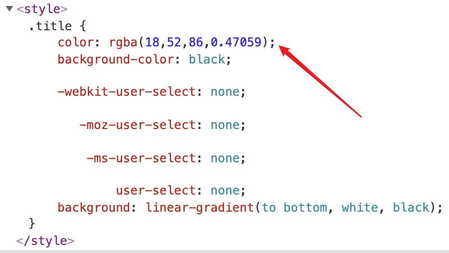

注：`postcss-preset-env` 并非只是专门用来转化这个的，而是集合了很多当前css转化兼容时所需要用到的大部分插件，包含了很多常见的转化。所以也可以单独配置这个插件，不用再配置`autoprefixer`，因为已经包含了它。

```javascript
{
  test: /\.css$/,
    use: [
      'style-loader',
      'css-loader',
      {
        loader: 'postcss-loader',
        options: {
          postcssOptions: {
            plugins: ['postcss-preset-env']
          }
        }
      }
    ]
}
```


postcss单独的配置文件`postcss.config.js`

```javascript
module.exports = {
    plugins: [
        require('postcss-preset-env')
    ]
}
```

有了这个配置文件以后，webpack配置就可以简单写了，而且可以避免重复配置。

webpack.config.js

```javascript
module: {
  rules: [
    {
      test: /\.css$/,
      use: ['style-loader', 'css-loader', 'postcss-loader']
    },
    {
      test: /\.less$/,
      use: ['style-loader', 'css-loader', 'postcss-loader', 'less-loader']
    }
  ]
}
```


【相关链接】

- [如果你不会Postcss，那么你就真的不会Postcss](https://zhuanlan.zhihu.com/p/269051473)
- [Autoprefixer CSS online](https://autoprefixer.github.io/)


### importLoaders

​	这个是css-loader的配置项，使用的场景是a.css中import了b.css，在执行loader时，a.css先使用postcss-loader进行处理，处理完了之后，再使用css-loader处理，这个时候才import了b.css，对于b.css来说，就缺少了postcss-loader的处理。

```
module: {
  rules: [
    {
      test: /\.css$/,
      use: [
      	'style-loader',
      	{
      		loader: 'css-loader',
      		options: {
      			importLoaders: 1
      		}
      	},
      	'postcss-loader']
    }
  ]
}
```

注：`importLoader: 1` 表示遇到import时，跳到前面1个loader进行处理。

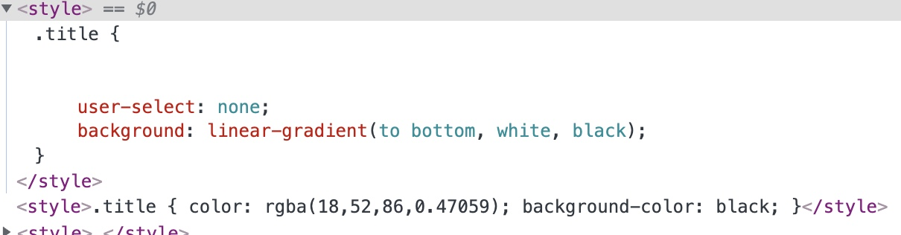

<p align="center">图6-3 importLoader使用前</p>

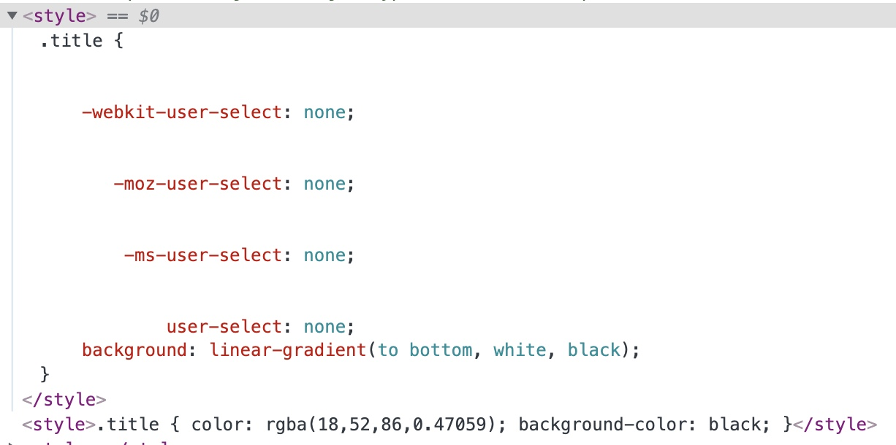

<p align="center">图6-4 importLoader使用后</p>


## 七、文件处理


安装：

```javascript
npm i -D file-loader
```


尝试引入图片：

```javascript

import webpackImg from '../images/webpack.jpg'

function createElement() {
    let oElement = document.createElement('div')

    let oImg = document.createElement('img')

    oImg.width = 400

  	// 下面是几种import方式
    // oImg.src = require('../images/webpack.jpg').default	// 使用require获取，需要从default获取（webpack5）
    // oImg.src = require('../images/webpack.jpg') // 在webpack配置文件里加上esModule:false选项可以不用default
    oImg.src = webpackImg	// 直接使用ES6的模块导入 引用

    oElement.appendChild(oImg)

    return oElement
}

document.body.appendChild(createElement())
```

配置：

```javascript
module: {
  rules: [
    {
      test: /\.png|jpe?g|svg$/,
      // use: ['file-loader']
      use: [
        {
          loader: 'file-loader',
          options: {
            esModule: false	// 加上这个配置，使用require获取图片，就不用从.default获取了
          }
        }
      ]
    }
  ]
}
```


背景图片url解析失败问题：

对于background-image可能会存在一个问题（此问题应该是存在于webpack5，5以下的版本没试过，问题来源于require().default）

```css
.bgImg {
  width: 400px;
  height: 300px;
  border: 1px solid #000;
  background-image: url('../images/webpack.jpg');
}
```

```javascript
import '../css/bg.css'

function createElement() {
    let oElement = document.createElement('div')
    oElement.className = 'bgImg'

    return oElement
}

document.body.appendChild(createElement())
```

打包后，可以看到图片是没有成功解析出来的，原因出自于css-loader。

当webpack在执行打包时，引入css后，css-loader读取到url('xxx')时，是会转化为require('xxx')进行获取的，也就是说，我们可能需要加上.default来获取，但是这里是css文件，不可以这么操作，所以应该是在webpack.config.js中配置esModule:false即可

```javascript
module: {
  rules: [
    {
      test: '/\.css$/',
      use: [
        'style-loader',
        {
          loader: 'css-loader',
          options: {
            importLoaders: 1,
            esModule: false
          }
        },
        'postcss-loader'
      ]
    }
  ]
}
```


文件输出的路径、名称配置：

​	可以在`file-loader`下配置name、outputPath来设置打包后的文件名以及路径

【常用占位符】file-loader提供了一些占位符可供我们使用

- [name]：文件名
- [ext]：文件后缀
- [hash]：md4算法得到了128位的字符
- [hashContent]：同[hash]，但有些区别，使用真正的文件内容哈希值
- [hash:<length>]：同[hash]，可配置长度
- ...[更多](https://www.npmjs.com/package/file-loader)

```javascript
module: {
  rules: [
    {
      test: /\.png|jpe?g|svg$/,
      use: [
        {
          loader: 'file-loader',
          options: {
            // name: 'imgs/[name]-[hash:6].[ext]' // 简写
            name: '[name]-[hash:6].[ext]',
            outputPath: 'imgs'
          }
        }
      ]
    }
  ]
}
```

输出结果：

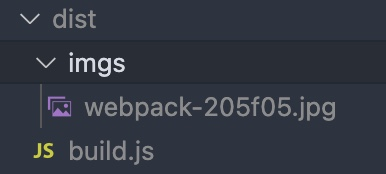


### url-loader

​	`url-loader`相对于`file-loader`的区别在于打包后会将资源文件转化为base64编码存放于代码中。好处在于可以减少请求次数，坏处在于资源文件过大时，响应时间变慢，影响用户体验。

​	另外，url-loader内部是可以使用file-loader的，加上limit条件作为区分即可。

安装：

```javascript
npm i -D url-loader
```

配置：

```javascript
module: {
	rules: [
		{
			test: /\.png|jpe?g|svg$/,
			use: [
				{
					loader: 'url-loader',
					options: {
						name: 'imgs/[name]-[hash:6].[ext]',
						limit: 200 * 1024	// 大于200K的文件使用file-loader处理
					}
				}
			]
		}
	]
}
```

结果：

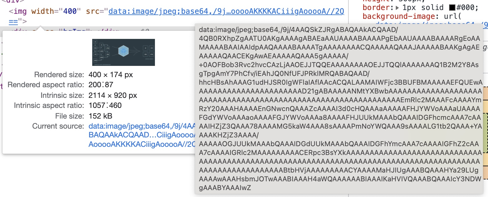

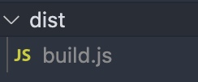

​	可以看到现在打包后的`dist`目录已经没有imgs目录输出，而是转化为Base64编码存放于js代码中了。假如图片大于200K，则会以file-loader的处理方式进行处理。


### assets资源模块

​	webpack5开始提供了assets资源模块（[Asset Modules](https://webpack.docschina.org/guides/asset-modules/)），不需要再去使用上述的具体loader了（file-loader、url-loader）

- asset/resource： 可以将目标资源拷贝到指定的目录中，功能相当于`file-loader`
- asset/inline： 可以将目标资源添加到行内代码中，功能相当于`url-loader `
- asset/source： 功能相当于`raw-loader`
- asset：可以进行动态判断，加上limit配置即可


拷贝目标资源到指定目录`asset/resource`：

```javascript
module: {
  rules: [
    {
      test: /\.png|jpe?g|gif|svg$/,
      type: 'asset/resource',	// 相当于指定以上后缀的文件，进行file-loader的处理
      generator: {	// 使用这个配置来设置拷贝后的资源路径和命名方式
        filename: 'static/imgs/[name]-[hash:6][ext]'	// 这里的[ext]会有.，所以就不用写.了
      }
    }
  ]
}
```

【补充】使用`assetModuleFilename`，可全局统一的配置拷贝后的资源路径和名称（这个其实不太合适，假如以后还要处理字体文件，那打包后的所有的拷贝资源(图片、字体)，都会放到同一个目录下，所以不建议这么做，知道有这个配置即可）

```javascript
const path = require('path')
module.exports = {
  ...
  output: {
    filename: 'build.js'
    path: path.resolve(__dirname, 'dist'),
		assetModuleFilename: 'static/[name]-[hash:6][ext]'	// 这里的[ext]会有.，所以就不用写.了
  },
  module: {
  	...
  	rules: [
  		{
  			test: /\.png|jpe?g|gif|svg$/,
        type: 'asset/resource'	// 相当于指定以上后缀的文件，进行file-loader的处理
  		}
  	]
  }
}
```


将目标资源写入行内代码，以base64的形式`asset/inline`：

```javascript
module: {
  rules: [
    {
      test: /\.png|jpe?g|gif|svg$/,
      type: 'asset/inline'		// 相当于指定以上后缀的文件，进行url-loader的处理
    }
  ]
}
```

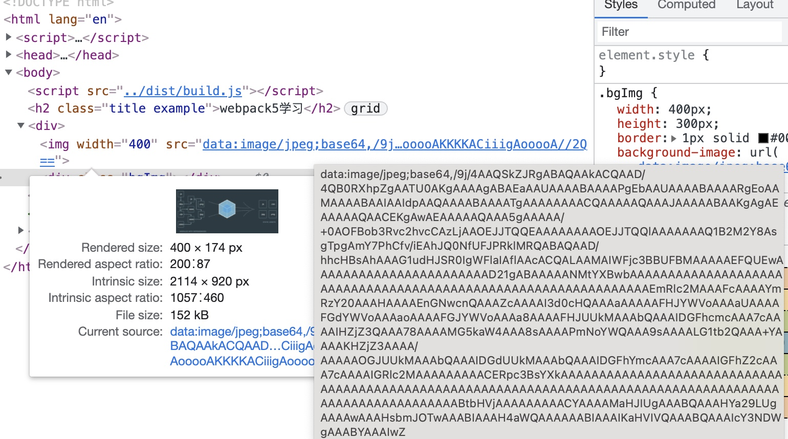

加上条件，按条件进行不同的处理：

```javascript
module: {
  rules: [
    {
      test: /\.png|gif|jpe?g|svg$/,
      type: 'asset',	// file-loader、url-loader都用上，具体判断需要加上配置
      generator: {	// file-loader输出文件的路径及文件命名形式
        filename: 'static/imgs/[name]-[hash:6][ext]'
      },
      parser: {
        dataUrlCondition: {
          maxSize: 200 *1024	// 超过200K的文件，使用asset/resource的方式处理，小于等于200K就用asset/inline处理
        }
      }
    }
  ]
}
```


### 字体文件处理

​	字体文件可从[阿里巴巴矢量图表库](https://www.iconfont.cn/)下载

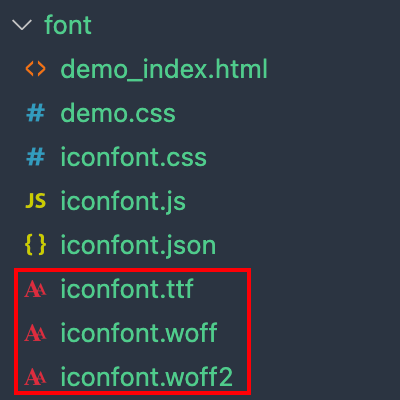

创建一个DOM，测试引入的字体图标

```javascript
import '../font/iconfont.css'

function packFont() {
    let oDiv = document.createElement('div')

    let oSpan = document.createElement('span')
    oSpan.className = "iconfont icon-charge-station"
    oDiv.appendChild(oSpan)

    return oDiv
}

document.body.appendChild(packFont())
```

添加webpack配置：

```javascript
module: {
  rules: [
    {
      test: /\.(ttf|woff2?)$/,
        type: 'asset',
          generator: {
            filename: 'static/fonts/[name]-[hash:3][ext]'
          }
    }
  ]
}
```

结果：


## 八、插件

​	loader的工作时机和作用都是非常明确的，在需要读取某一个特定资源的内容时，对文件进行转换。

​	而插件，可以贯穿webpack整个生命周期，可以做的事情不止转化资源文件，它还可以做其他更多的事情（比如每次先删除dist目录、title的修改、打包的优化、压缩处理、定义全局变量 等）。

​	插件的本质是一个个类。


### clean-webpack-plugin

​	此插件可以在项目打包前，删除旧的打包文件。

安装：

```
npm i -D clean-webpack-plugin
```

配置：

```javascript
const { CleanWebpackPlugin } = require('clean-webpack-plugin')

module.exports = {
  plugins: [
    new CleanWebpackPlugin()
  ]
}
```


### html-webpack-plugin

​	此插件可以在打包后的目录中添加一个html文件，自动引用入口JS文件。

安装：

```
npm i -D html-webpack-plugin
```

配置：

```javascript
const HtmlWebpackPlugin = require('html-webpack-plugin')

module.exports = {
  plugins: [
    new HtmlWebpackPlugin({
      title: 'html-webpack-plugin',		// 打包后的title
      template: './public/index.html'	// 指定输出的html的模版文件
    })
  ]
}
```

模版文件：

```html
<!DOCTYPE html>
<html lang="en">
<head>
    <meta charset="UTF-8">
    <meta http-equiv="X-UA-Compatible" content="IE=edge">
    <meta name="viewport" content="width=device-width, initial-scale=1.0">
    <title>
        <%=htmlWebpackPlugin.options.title%>
    </title>
</head>
<body>
    <div id="app">webpack-html-plugin</div>
</body>
</html>
```


### DefinePlugin

​	此插件是webpack自带的插件，可用于定义全局常量。

配置：

```javascript
const { CleanWebpackPlugin } = require('clean-webpack-plugin')
const HtmlWebpackPlugin = require('html-webpack-plugin')
const { DefinePlugin } = require('webpack')

module.exports = {
    plugins: [
        new CleanWebpackPlugin(),
        new HtmlWebpackPlugin({
            title: 'html-webpack-plugin',
            template: './public/index.html'
        }),
        new DefinePlugin({
            BASE_URL: '"./"'	// 注意此常量会直接赋值，所以如果是字符串，需要在里面再加引号
        })
    ]
}
```

模版文件：

```html
<!DOCTYPE html>
<html lang="en">
<head>
    <meta charset="UTF-8">
    <meta http-equiv="X-UA-Compatible" content="IE=edge">
    <meta name="viewport" content="width=device-width, initial-scale=1.0">
    <title>
        <%=htmlWebpackPlugin.options.title%>
    </title>
    <!-- BASE_URL	是webpack内定义的常量 -->
    <link rel="icon" href="<%= BASE_URL %>favicon.jpg">
</head>
<body>
    <div id="app">webpack-html-plugin</div>
</body>
</html>
```


## babel

 	ES6以及ES6+的部分语法，并不是所有浏览器都可以识别的，可以需要借助babel工具，对我们的代码进行转化，保证所有浏览器都能识别，确保兼容性。


安装：

```shell
npm i -D @babel/core	// 安装核心
npm i -D @babel/cli		// 可支持在命令行终端使用npx babel
```

【注】@babel/cli 是为了在命令行使用babel指令，如不需要可不安装。

转化：

```shell
npx babel src --out-dir build
```

- src：指定目标目录，也可以是具体文件
- --out-dir：指定输出目录

结果：


​	可以看到转化后的结果，跟源文件是一样的。

​	当前的babel/core 只是可以起到源代码转化的作用，如果需要在转化的过程中做出其他修改，则需要安装拥有对应功能的其他工具包去进行对应的处理。


##### 箭头函数转化工具包 - plugin-transform-arrow-function

安装：

```
npm i -D @babel/plugin-transform-arrow-functions
```

指令：

```
npx babel src --out-dir build --plugins=@babel/plugin-transform-arrow-functions
```

结果：

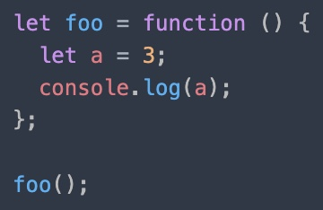

箭头函数转化为了function(){}


##### 处理跨作用域 - plugin-transform-block-scoping

安装：

```
npm i -D @babel/plugin-transform-block-scoping
```

指令：

```
npx babel src --out-dir build --plugins=@babel/plugin-transform-arrow-functions,@babel/plugin-transform-block-scoping
```

结果：

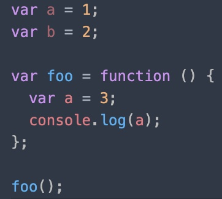

​	let、const都转化为了var


##### preset-env 预设

​	可以发现如果像这样一个个插件使用，有些麻烦，babel提供的预设的包，也就是插件的一个集合，可供使用。

​	另外，此预设插件，可以会去查browserslist，去匹配兼容性，做出对应的兼容性处理。

安装：

```
npm i -D @babel/preset-env
```

命令：

```
npx babel src --out-dir build --presets=@babel/preset-env
```

结果：

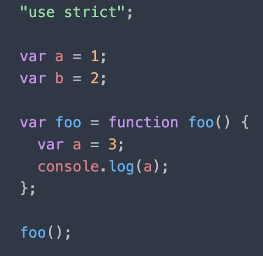


##### babel-loader

​	使用loader可以提前在配置文件里面加入所需参数，这样每次打包就可以自动使用babel进行转化，不用再使用babel的命令行工具进行转化了。

配置：

```javascript
module.exports = {
  module: {
    rules: [
      {
        test: /^\.js$/,
        use: [
          {
            loader: 'babel-loader',
            options: {
              //plugins: [	// 插件配置
              //  '@babel/plugin-transform-arrow-functions',
              //  '@babel/plugin-transform-block-scoping'
              //]
              // 预设
              presets: [
                [
                  '@babel/preset-env',
                  { targets: 'chrome 91' }	// 兼容chrome 91
                ]
              ]
            }
          }
        ]
      }
    ]
  }
}
```


##### babel-loader的配置文件

​	使用配置文件会更好一些，避免在webpack配置文件中，层层嵌套，且不可在其他项目文件中复用。


【配置文件】

- babel.config.js（.json也可）
- babelrc.js（.json也可）

在根路径创建一个babel.config.js，babel-loader会自动去获取此配置文件里的配置进行对应的兼容性处理。

```javascript
module.exports = {
    preset: ['@babel/preset-env']
}
```

webpack.config.js

```javascript
module.exports = {
	module: {
    rules: [
      {
        test: /\^.js$/,
        use: ['babel-loader']
      }
    ]
  }
}
```


